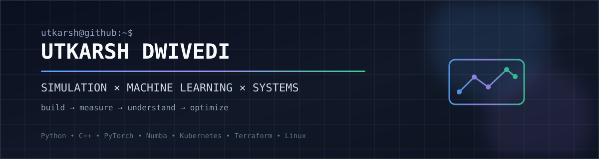

<p align="center">
  
</p>

<p align="center">
  <a href="https://github.com/utkdwivedi"></a>
  <a href="https://www.linkedin.com/in/utkarsh-dwivedi-5938b23aa/"></a>
  <a href="RESUME.md"></a>
</p>

<p align="center">
  
  
</p>

## `$ whoami`

> Engineering student building software at the intersection of **simulation, machine learning, systems, and infrastructure**.

I like working below the abstraction layer — understanding the model, the algorithm, the bottleneck, and the system that makes the whole thing work.

---

## ⚡ Currently Building

<table>
<tr>
<td width="50%" valign="top">

### 🧮 Physics → Data → ML

Building a **ballistic simulation engine** for impact physics, material behavior, strain-rate effects, and high-throughput synthetic dataset generation for ML/PINN experiments.

**Python · NumPy · SciPy · Numba · PyTorch · Parquet**

</td>
<td width="50%" valign="top">

### ☸️ Infrastructure That Runs Itself

Building a reproducible **GitOps Kubernetes homelab** with declarative provisioning, automated reconciliation, observability, policy enforcement, encrypted secrets, and zero-trust ingress.

**K3s · Terraform · Ansible · FluxCD · Cilium · Prometheus · Grafana**

</td>
</tr>
</table>

---

## 🚀 Featured Projects

### 01 · [Ballistic Simulation Engine](https://github.com/utkdwivedi/Ballistic-Simulation-Engine)

**Physics → Simulation → Synthetic Data → ML / PINN**

A physics-based impact simulation engine designed to turn constitutive material models and numerical simulation into structured, ML-ready datasets.

`Johnson-Cook` · `Cowper-Symonds` · `Numba` · `PyTorch` · `Parquet`

[](https://github.com/utkdwivedi/Ballistic-Simulation-Engine)

### 02 · [Homelab — GitOps Kubernetes Cluster](https://github.com/utkdwivedi/homelab)

**Infrastructure → GitOps → Observability → Services**

A self-hosted Kubernetes platform built around Infrastructure as Code and continuous reconciliation.

`K3s` · `Kubernetes` · `Terraform` · `Ansible` · `FluxCD` · `Cilium` · `Prometheus` · `Grafana`

[](https://github.com/utkdwivedi/homelab/tags)
[](https://homelab.khuedoan.com)
[](https://github.com/utkdwivedi/homelab)

### 03 · [Retro-Synth](https://github.com/utkdwivedi/Retro-Synth)

A creative coding project exploring browser-based audio and retro-inspired interaction.

[](https://github.com/utkdwivedi/Retro-Synth)

---

## 🧠 How I Think

```text
        REAL-WORLD PROBLEM
                │
                ▼
             MODEL
                │
                ▼
           SIMULATE
                │
                ▼
          GENERATE DATA
                │
                ▼
            VALIDATE
                │
                ▼
           OPTIMIZE
                │
                ▼
            DEPLOY
```

I prefer projects where assumptions can be **measured**, systems can be **tested**, and performance can be **improved**.

---

## 🛠️ Engineering Stack

**Languages**

`Python` `C++` `Java` `JavaScript`

**Scientific Computing / ML**

`NumPy` `SciPy` `Pandas` `Matplotlib` `PyTorch` `Numba`

**Systems / Infrastructure**

`Linux` `Docker` `Kubernetes` `K3s` `Terraform` `Ansible` `FluxCD` `Cilium`

**Engineering Tools**

`Git` `GitHub` `Bash` `VS Code`

<p align="center">
  
</p>

---

## 📊 GitHub Activity

<p align="center">
  
  
</p>

<p align="center">
  
</p>

---

## 🐍 Contribution Graph

<p align="center">
  <picture>
    <source media="(prefers-color-scheme: dark)" srcset="assets/github-snake-dark.svg">
    <source media="(prefers-color-scheme: light)" srcset="assets/github-snake.svg">
    
  </picture>
</p>

> The snake is refreshed automatically by GitHub Actions.

---

## 🔭 What I'm Working Toward

- Stronger **software engineering fundamentals**
- Backend and **systems engineering**
- High-performance Python and numerical computing
- Machine learning grounded in physical models
- Infrastructure that is reproducible, observable, and automated

---

## 🧩 Beyond the Code

⚡ I enjoy understanding what happens **under the abstraction layer**.  
🔧 I prefer building measurable projects over collecting disconnected demos.  
🧠 I like taking a problem from **model → implementation → validation → optimization**.

---

<details>
<summary>👀 You found the hidden section</summary>

<br>

```bash
$ sudo apt install more-coffee
$ python3 build_something_cool.py
$ echo "ship it"
ship it
```

**If it works:** understand why.  
**If it doesn't:** understand why.

</details>

---

<p align="center">
  <b>Build.</b>&nbsp;&nbsp;
  <b>Measure.</b>&nbsp;&nbsp;
  <b>Understand.</b>&nbsp;&nbsp;
  <b>Optimize.</b>
</p>

<p align="center">
  <sub>Lucknow, India · Engineering Student</sub>
</p>
